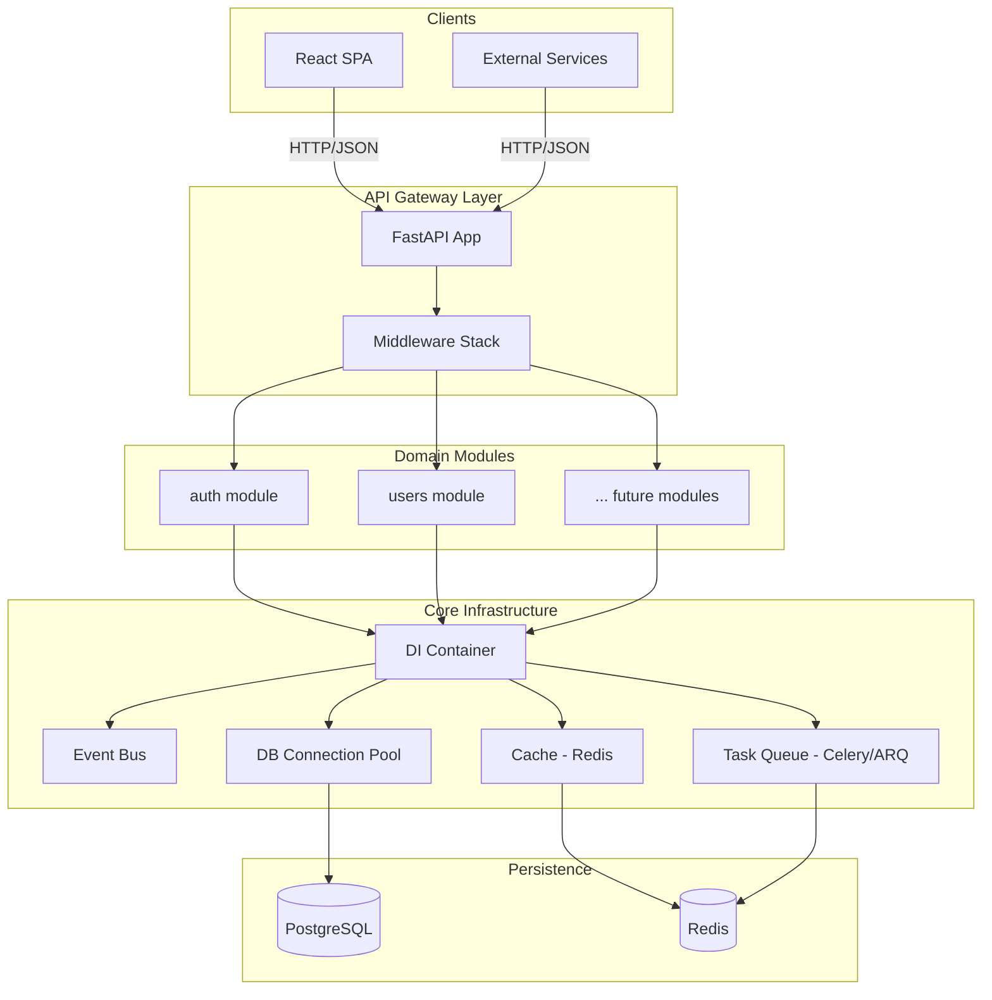
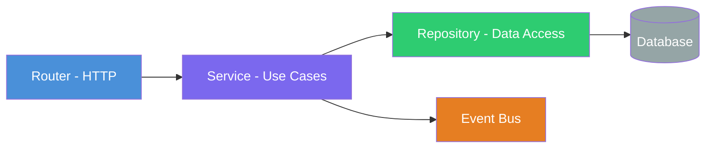
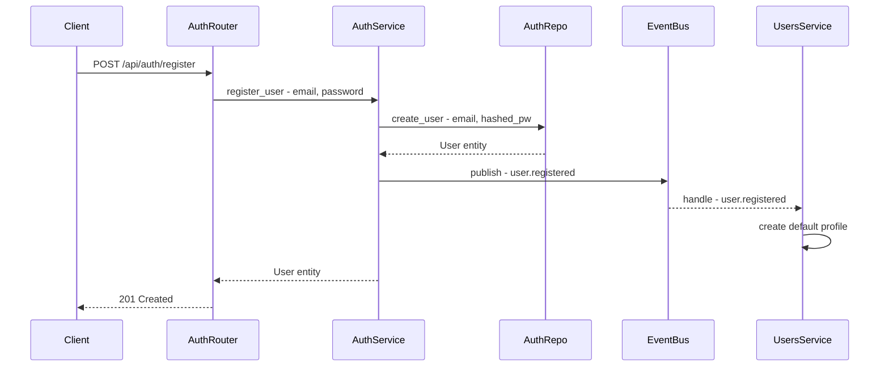
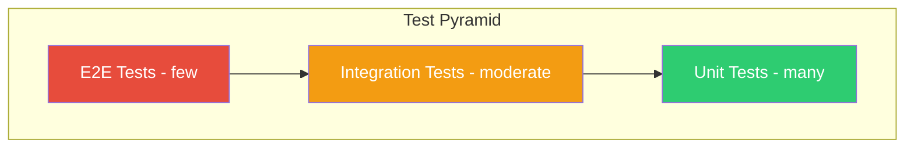

# Backend Architecture — Domain-Driven Modular Design

> **Stack:** Python 3.12+ · FastAPI · Uvicorn · asyncpg · Pydantic v2 · PostgreSQL  
> **Current state:** Single [`main.py`](../BE/main.py) with inline routes, hashing helpers, and a global connection pool.  
> **Target state:** A modular, domain-driven architecture that supports many bounded contexts, dependency injection, an internal event bus, and clean separation of concerns.

---

## 1. High-Level Architecture



---

## 2. Target Directory Structure

```
BE/
├── main.py                          # App factory, lifespan, mount routers
├── config.py                        # Settings via pydantic-settings
├── container.py                     # DI container wiring
├── requirements.txt
├── Dockerfile
│
├── core/                            # Shared infrastructure
│   ├── __init__.py
│   ├── database.py                  # asyncpg pool lifecycle
│   ├── events.py                    # In-process event bus
│   ├── security.py                  # Password hashing, JWT helpers
│   ├── exceptions.py                # Base domain exceptions
│   ├── middleware/
│   │   ├── __init__.py
│   │   ├── error_handler.py         # Global exception → JSON mapping
│   │   ├── auth.py                  # JWT bearer dependency
│   │   └── logging.py              # Request/response logging
│   └── types.py                     # Shared type aliases, base schemas
│
├── modules/                         # One sub-package per bounded context
│   ├── __init__.py
│   │
│   ├── auth/                        # Authentication domain
│   │   ├── __init__.py
│   │   ├── router.py                # FastAPI APIRouter — HTTP layer
│   │   ├── schemas.py               # Pydantic request/response models
│   │   ├── service.py               # Business logic / use cases
│   │   ├── repository.py            # Data access — SQL queries
│   │   ├── models.py                # Domain entities / value objects
│   │   ├── events.py                # Domain events emitted by auth
│   │   └── exceptions.py            # Auth-specific exceptions
│   │
│   ├── users/                       # User management domain
│   │   ├── __init__.py
│   │   ├── router.py
│   │   ├── schemas.py
│   │   ├── service.py
│   │   ├── repository.py
│   │   ├── models.py
│   │   ├── events.py
│   │   └── exceptions.py
│   │
│   └── ...                          # Future: notifications, billing, etc.
│
├── migrations/                      # Alembic or raw SQL migrations
│   ├── env.py
│   └── versions/
│
└── tests/
    ├── conftest.py                  # Fixtures: test DB, DI overrides
    ├── unit/
    │   ├── test_auth_service.py
    │   └── test_user_service.py
    └── integration/
        ├── test_auth_api.py
        └── test_user_api.py
```

---

## 3. Layer Responsibilities

Each domain module follows a strict **4-layer** pattern:



| Layer | File | Responsibility | Depends On |
|-------|------|----------------|------------|
| **Router** | `router.py` | HTTP concerns: parse request, validate with Pydantic, call service, return response. No business logic. | Service |
| **Service** | `service.py` | Orchestrates use cases, enforces business rules, emits domain events. Pure Python — no HTTP or SQL. | Repository, Event Bus |
| **Repository** | `repository.py` | Raw SQL via asyncpg. Returns domain models. One method per query. | Database pool |
| **Models** | `models.py` | Domain entities and value objects. Plain dataclasses or Pydantic models. No I/O. | Nothing |

### Key rules

- **Routers never import repositories** — they only know about services.
- **Services never import FastAPI** — they receive plain Python objects and return domain models.
- **Repositories never contain business logic** — they are thin SQL wrappers.
- **Domain events decouple modules** — e.g., `auth` emits `UserRegistered`; `users` listens and creates a profile.

---

## 4. Dependency Injection

Use [`dependency-injector`](https://python-dependency-injector.ets-labs.org/) or a lightweight custom container.

### `container.py` — Wiring Example

```python
# Conceptual — not runnable as-is
from dependency_injector import containers, providers
from core.database import create_pool
from modules.auth.repository import AuthRepository
from modules.auth.service import AuthService

class Container(containers.DeclarativeContainer):
    config = providers.Configuration()

    db_pool = providers.Resource(
        create_pool,
        host=config.db.host,
        port=config.db.port,
        database=config.db.name,
        user=config.db.user,
        password=config.db.password,
    )

    # Auth domain
    auth_repository = providers.Factory(AuthRepository, pool=db_pool)
    auth_service = providers.Factory(AuthService, repo=auth_repository)
```

### Why DI matters

- **Testability:** Swap real repos for in-memory fakes in unit tests.
- **Decoupling:** Services don't know how the pool is created.
- **Configuration:** Single source of truth for wiring.

---

## 5. Event Bus

An in-process pub/sub system for cross-module communication without direct imports.

### `core/events.py` — Design

```python
# Conceptual
import asyncio
from typing import Any, Callable, Coroutine

EventHandler = Callable[..., Coroutine[Any, Any, None]]

class EventBus:
    def __init__(self):
        self._handlers: dict[str, list[EventHandler]] = {}

    def subscribe(self, event_name: str, handler: EventHandler):
        self._handlers.setdefault(event_name, []).append(handler)

    async def publish(self, event_name: str, payload: dict):
        for handler in self._handlers.get(event_name, []):
            asyncio.create_task(handler(payload))
```

### Event flow example



---

## 6. Configuration

Use `pydantic-settings` for type-safe, env-driven config:

### `config.py`

```python
from pydantic_settings import BaseSettings

class Settings(BaseSettings):
    # Database
    db_host: str = "localhost"
    db_port: int = 5432
    db_name: str = "login_db"
    db_user: str = "login_user"
    db_password: str = "login_pass"

    # JWT
    jwt_secret: str = "change-me-in-production"
    jwt_algorithm: str = "HS256"
    jwt_expire_minutes: int = 30

    # CORS
    cors_origins: list[str] = ["*"]

    # Redis (future)
    redis_url: str = "redis://localhost:6379/0"

    class Config:
        env_file = ".env"
        env_file_encoding = "utf-8"
```

---

## 7. Authentication & Authorization

### Current state
- Password hashing with `salt$sha256` in [`main.py`](../BE/main.py:65).
- No token issuance — login returns `{"message": "Logged in"}`.

### Target state
- **JWT access + refresh tokens** issued on login.
- Access token: short-lived (15–30 min), sent in `Authorization: Bearer` header.
- Refresh token: long-lived (7 days), stored in HTTP-only cookie or DB.
- **Role-based access control (RBAC):** `User.role` field → middleware checks.

### Auth middleware dependency

```python
# core/middleware/auth.py — conceptual
from fastapi import Depends, HTTPException
from fastapi.security import HTTPBearer

bearer = HTTPBearer()

async def get_current_user(token = Depends(bearer)):
    payload = decode_jwt(token.credentials)
    if not payload:
        raise HTTPException(401, "Invalid token")
    return payload
```

---

## 8. Error Handling Strategy

### `core/exceptions.py`

```python
class DomainException(Exception):
    status_code: int = 400
    detail: str = "Domain error"

class NotFoundError(DomainException):
    status_code = 404

class ConflictError(DomainException):
    status_code = 409

class UnauthorizedError(DomainException):
    status_code = 401
```

### `core/middleware/error_handler.py`

A single exception handler catches all `DomainException` subclasses and returns consistent JSON:

```json
{
  "error": "Email already registered",
  "code": "CONFLICT",
  "status": 409
}
```

---

## 9. Database Strategy

| Concern | Approach |
|---------|----------|
| **Connection pool** | `asyncpg.create_pool()` managed in [`core/database.py`](../BE/main.py:42) via lifespan |
| **Migrations** | Alembic with async driver, or versioned raw SQL in `migrations/` |
| **Query pattern** | Raw SQL in repositories (no ORM). Parameterized queries only. |
| **Transactions** | `async with pool.acquire() as conn: async with conn.transaction():` |
| **Schema per module** | Optional — use PostgreSQL schemas to isolate domains: `auth.users`, `billing.invoices` |

### Why raw SQL over ORM

- Full control over query performance.
- asyncpg is the fastest Python PostgreSQL driver.
- Avoids ORM abstraction leaks in complex queries.
- Repositories already encapsulate data access.

---

## 10. Testing Strategy



| Level | What | Tools | DB |
|-------|------|-------|----|
| **Unit** | Services with mocked repos | `pytest`, `unittest.mock` | None |
| **Integration** | Routers → DB round-trip | `pytest`, `httpx.AsyncClient`, `testcontainers` | Real PostgreSQL in Docker |
| **E2E** | Full stack via HTTP | `pytest` + `httpx` | Docker Compose test profile |

### Test DI override pattern

```python
# tests/conftest.py — conceptual
@pytest.fixture
def app_with_fakes():
    container = Container()
    container.auth_repository.override(providers.Factory(FakeAuthRepository))
    app = create_app(container)
    yield app
    container.unwire()
```

---

## 11. Future Scalability Considerations

| Concern | Solution |
|---------|----------|
| **Background tasks** | ARQ or Celery workers consuming from Redis |
| **Caching** | Redis via `aioredis` — cache frequently read data |
| **Rate limiting** | `slowapi` middleware or API gateway |
| **Observability** | Structured logging with `structlog`, OpenTelemetry traces |
| **API versioning** | URL prefix: `/api/v1/`, `/api/v2/` |
| **WebSockets** | FastAPI native WebSocket support for real-time features |
| **CQRS** | Separate read/write models when query patterns diverge |
| **Multi-tenancy** | Schema-per-tenant or row-level security in PostgreSQL |

---

## 12. Migration Plan from Current State

The refactoring from the current single-file structure to the modular architecture should be done incrementally:

| Step | Action | Risk |
|------|--------|------|
| 1 | Create `config.py` with `pydantic-settings`, replace `os.getenv` calls | Low |
| 2 | Create `core/database.py` — extract pool lifecycle | Low |
| 3 | Create `core/security.py` — extract `_hash_password`, `_verify_password` | Low |
| 4 | Create `core/exceptions.py` and `core/middleware/error_handler.py` | Low |
| 5 | Create `modules/auth/` — move register/login logic into router → service → repo | Medium |
| 6 | Set up DI container, wire services | Medium |
| 7 | Add JWT token issuance and auth middleware | Medium |
| 8 | Create `modules/users/` — user profile CRUD | Low |
| 9 | Implement event bus, wire cross-module events | Medium |
| 10 | Add Alembic migrations | Low |
| 11 | Add test infrastructure with `pytest` + `httpx` | Low |

---

## 13. Key Dependencies to Add

| Package | Purpose |
|---------|---------|
| `pydantic-settings` | Type-safe configuration from env/.env |
| `python-jose[cryptography]` or `PyJWT` | JWT encoding/decoding |
| `dependency-injector` | DI container (optional — can use FastAPI `Depends` only) |
| `alembic` | Database migrations |
| `pytest` + `pytest-asyncio` + `httpx` | Testing |
| `structlog` | Structured logging |
| `aioredis` / `redis[hiredis]` | Redis client (when needed) |
| `arq` | Async task queue (when needed) |
