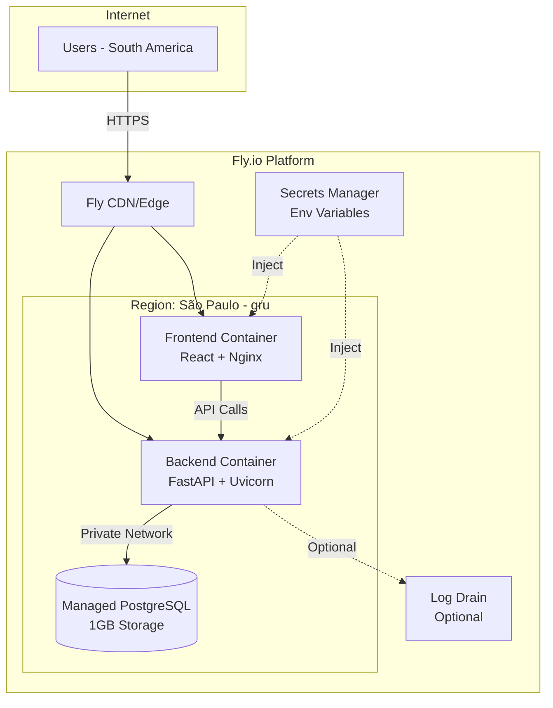

# Cloud Architecture - Cheap & Safe Deployment

> **Requirements:** Low traffic (<100 users), budget under $20/month, users in South America  
> **Project:** Full-stack login app (React + FastAPI + PostgreSQL)

---

## Executive Summary

For a low-traffic application targeting South American users with a budget under $20/month, I recommend **Fly.io** as the primary option due to its São Paulo region availability, simple pricing, and included security features. Alternative options are provided for comparison.

| Option | Monthly Cost | Region | Latency to SA | Complexity |
|--------|-------------|--------|---------------|------------|
| **Fly.io (Recommended)** | ~$7-12 | São Paulo | ~10-20ms | Low |
| Render | ~$14 | Oregon, USA | ~150ms | Very Low |
| Railway | ~$10-15 | Oregon, USA | ~150ms | Very Low |
| AWS Free Tier | $0-15 | São Paulo | ~10-20ms | High |
| Supabase + Vercel | $0-5 | Multiple | ~50-100ms | Low |

---

## Recommended Architecture: Fly.io

### Why Fly.io?

1. **São Paulo Region (gru)** - Lowest latency for South American users
2. **Simple Pricing** - Pay only for what you use
3. **Built-in Security** - HTTPS, private networking, secrets management
4. **Docker-native** - Works with your existing Dockerfiles
5. **Managed PostgreSQL** - Automated backups, high availability

### Architecture Diagram



### Cost Breakdown

| Component | Specification | Monthly Cost |
|-----------|--------------|--------------|
| Frontend (static) | 1x shared-cpu, 256MB | ~$2-3 |
| Backend API | 1x shared-cpu, 512MB | ~$3-5 |
| PostgreSQL | 1GB storage, HA mode | ~$7/month |
| **Total** | | **~$12-15/month** |

> **Note:** Fly.io offers free allowance ($5/month credit) for new accounts, reducing first-year costs.

### Security Features Included

| Feature | Description |
|---------|-------------|
| **HTTPS/TLS** | Automatic SSL certificates via Let's Encrypt |
| **Private Networking** | Database not exposed to public internet |
| **Secrets Management** | Encrypted environment variables |
| **DDoS Protection** | Built-in at edge level |
| **Automated Backups** | Daily backups for PostgreSQL |

---

## Deployment Configuration

### 1. Fly.io Setup

Install the Fly CLI and authenticate:

```bash
# Install flyctl
curl -L https://fly.io/install.sh | sh

# Login
fly auth login

# Create apps
fly apps create login-app-frontend
fly apps create login-app-backend
```

### 2. PostgreSQL Database

```bash
# Create PostgreSQL cluster in São Paulo
fly postgres create \
  --name login-db \
  --region gru \
  --vm-size shared-cpu-1x \
  --volume-size 1

# Attach to backend
fly postgres attach login-db --app login-app-backend
```

### 3. Backend Deployment

Create `fly.toml` in [`BE/`](BE/) directory:

```toml
# BE/fly.toml
app = "login-app-backend"
primary_region = "gru"

[build]
  dockerfile = "Dockerfile"

[env]
  PORT = "18080"
  DB_PORT = "5432"

[[services]]
  internal_port = 18080
  protocol = "tcp"

  [[services.ports]]
    force_https = true
    handlers = ["http"]
    port = 80

  [[services.ports]]
    handlers = ["tls", "http"]
    port = 443

  [[services.tcp_checks]]
    grace_period = "10s"
    interval = "30s"
    port = "18080"
    restart_limit = 3
    timeout = "5s"
```

Deploy:

```bash
cd BE
fly deploy
```

### 4. Frontend Deployment

Create `fly.toml` in [`FE/`](FE/) directory:

```toml
# FE/fly.toml
app = "login-app-frontend"
primary_region = "gru"

[build]
  dockerfile = "Dockerfile"

[build.args]
  VITE_API_URL = "https://login-app-backend.fly.dev"

[[services]]
  internal_port = 80
  protocol = "tcp"

  [[services.ports]]
    force_https = true
    handlers = ["http"]
    port = 80

  [[services.ports]]
    handlers = ["tls", "http"]
    port = 443
```

Deploy:

```bash
cd FE
fly deploy
```

### 5. Environment Variables

Set secrets for the backend:

```bash
fly secrets set \
  --app login-app-backend \
  DB_PASSWORD=<secure-password> \
  JWT_SECRET=<jwt-signing-secret>
```

---

## Alternative Options

### Option 2: Render (Simplest)

**Pros:** Zero-config deployments, automatic SSL, generous free tier  
**Cons:** No South America region, higher latency (~150ms)

```
Architecture:
- Frontend: Static site (Free)
- Backend: Web Service Starter ($7/month)
- Database: PostgreSQL Starter ($7/month)
Total: ~$14/month
```

### Option 3: Railway (Developer-Friendly)

**Pros:** Simple UI, GitHub integration, easy scaling  
**Cons:** No South America region

```
Architecture:
- Frontend: Static deployment (~$1-2)
- Backend: 512MB container (~$5)
- Database: 1GB PostgreSQL (~$5)
Total: ~$11-12/month
```

### Option 4: AWS Free Tier (First Year Free)

**Pros:** São Paulo region (sa-east-1), enterprise features  
**Cons:** Complex setup, costs increase after 12 months

```
Architecture:
- EC2 t2.micro: Free (12 months)
- RDS PostgreSQL t3.micro: Free (12 months)
- S3 + CloudFront for frontend: ~$1-2
After 12 months: ~$15-20/month
```

### Option 5: Supabase + Vercel (Free Tier)

**Pros:** Free tier available, includes auth features  
**Cons:** May need code changes, free tier limits

```
Architecture:
- Frontend: Vercel (Free)
- Database: Supabase PostgreSQL (Free - 500MB)
- Backend: Deploy to Vercel/Render or use Supabase Edge Functions
Total: $0-5/month
```

---

## Security Checklist

### Application Security

- [x] Password hashing implemented (salt + SHA256)
- [ ] Add rate limiting to prevent brute force attacks
- [ ] Implement JWT token expiration and refresh
- [ ] Add CORS configuration for production
- [ ] Enable request logging for audit trail

### Infrastructure Security

- [x] HTTPS enforced (automatic with Fly.io)
- [x] Database on private network (not publicly accessible)
- [x] Secrets stored in encrypted environment variables
- [x] Automated database backups enabled
- [ ] Configure firewall rules (if needed)

### Recommended Security Enhancements

1. **Rate Limiting** - Add to FastAPI middleware:

```python
# Add to BE/core/middleware/rate_limit.py
from slowapi import Limiter
from slowapi.util import get_remote_address

limiter = Limiter(key_func=get_remote_address)
```

2. **CORS Configuration** - Update [`BE/main.py`](BE/main.py):

```python
from fastapi.middleware.cors import CORSMiddleware

app.add_middleware(
    CORSMiddleware,
    allow_origins=["https://login-app-frontend.fly.dev"],
    allow_credentials=True,
    allow_methods=["GET", "POST"],
    allow_headers=["*"],
)
```

3. **Health Check Endpoint** - Already implemented at `/api/health`

---

## Monitoring & Observability

### Built-in Monitoring (Fly.io)

- **Metrics Dashboard:** CPU, memory, response times
- **Log Streaming:** `fly logs -a login-app-backend`
- **Alerting:** Configure via integrations

### Recommended Add-ons

| Service | Purpose | Cost |
|---------|---------|------|
| **Sentry** | Error tracking | Free tier |
| **Grafana Cloud** | Metrics & dashboards | Free tier |
| **Better Stack** | Log management | Free tier |

---

## Scaling Path

When traffic grows beyond 100 users:

1. **Vertical Scaling** - Increase VM size (shared-cpu-2x)
2. **Horizontal Scaling** - Add more instances
3. **Database Scaling** - Increase storage or upgrade to dedicated cluster
4. **CDN** - Enable Fly.io's global CDN for static assets


---

## Cost Optimization Tips

1. **Use spot instances** - Fly.io offers discounted spot VMs for non-critical workloads
2. **Scale to zero** - Configure auto-suspend for low-traffic periods
3. **Optimize Docker images** - Smaller images = faster deploys, less storage
4. **Monitor usage** - Set billing alerts to avoid surprises

---

## Summary

For your login application with South American users and a sub-$20 budget:

| Recommendation | Rationale |
|----------------|-----------|
| **Primary Choice** | Fly.io - Best latency, simple pricing, built-in security |
| **Budget** | ~$12-15/month (within $20 target) |
| **Region** | São Paulo (gru) - optimal for South America |
| **Security** | HTTPS, private networking, secrets management included |
| **Complexity** | Low - Docker-native deployment |

The architecture provides a secure, cost-effective foundation that can scale as your user base grows.