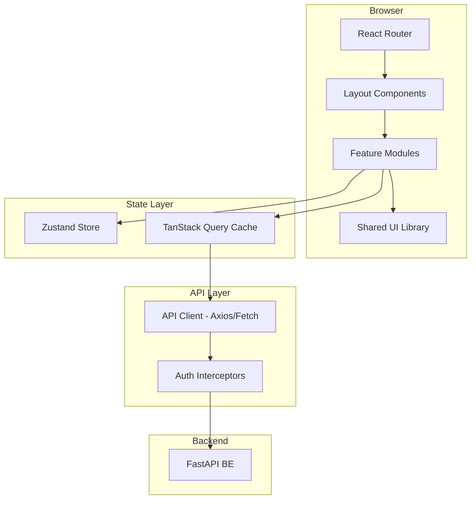
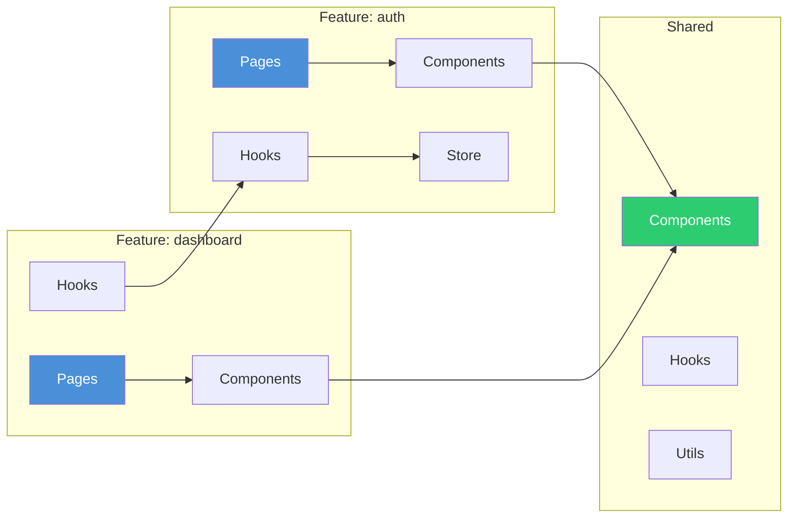
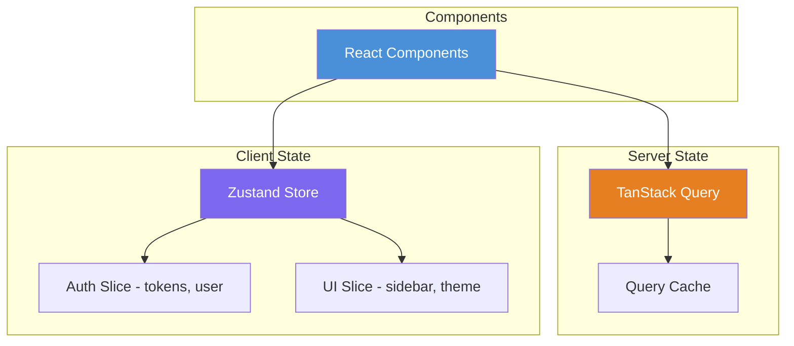
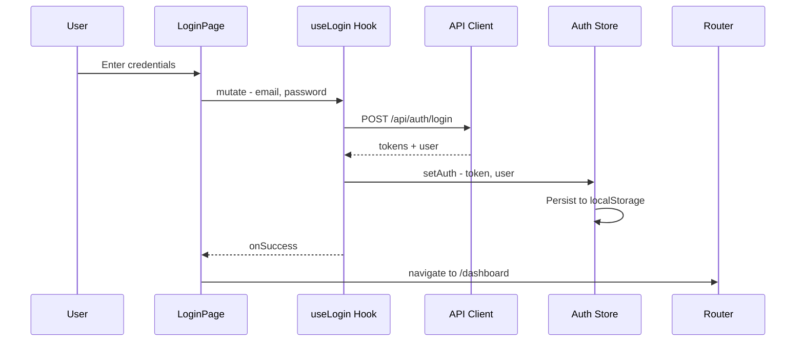
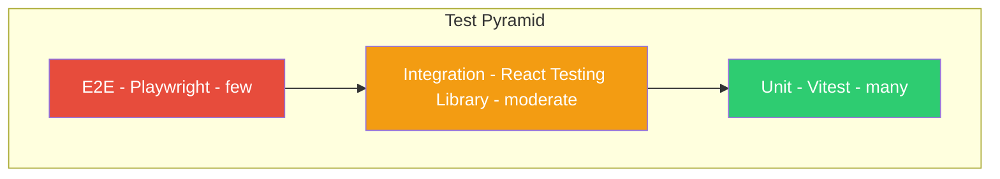

# Frontend Architecture — Feature-Sliced Modular Design

> **Stack:** React 19 · Vite 7 · Tailwind CSS 4 · JavaScript (ESM)  
> **Current state:** Flat [`src/`](../FE/src/) with [`App.jsx`](../FE/src/App.jsx), [`LoginPage.jsx`](../FE/src/LoginPage.jsx), and [`api.js`](../FE/src/api.js) — no routing, no state management, no feature separation.  
> **Target state:** A feature-sliced architecture with client-side routing, global state management, an API client layer, and domain-isolated feature modules that mirror the backend bounded contexts.

---

## 1. High-Level Architecture



---

## 2. Target Directory Structure

```
FE/
├── index.html
├── vite.config.js
├── tailwind.config.js              # If customization needed beyond v4 defaults
├── package.json
├── Dockerfile
├── nginx.conf
│
├── public/
│   └── vite.svg
│
├── src/
│   ├── main.jsx                    # React root, providers, router mount
│   ├── App.jsx                     # Root component — layout shell + <Outlet />
│   ├── router.jsx                  # Centralized route definitions
│   │
│   ├── app/                        # Application-level wiring
│   │   ├── providers.jsx           # Compose all context providers
│   │   ├── store.js                # Root Zustand store (or store index)
│   │   └── queryClient.js          # TanStack Query client config
│   │
│   ├── api/                        # API client layer
│   │   ├── client.js               # Axios/fetch instance + base config
│   │   ├── interceptors.js         # Auth token injection, 401 refresh
│   │   └── endpoints/              # One file per backend domain
│   │       ├── auth.js             # login, register, refresh, logout
│   │       ├── users.js            # getProfile, updateProfile
│   │       └── index.js            # Re-export all endpoints
│   │
│   ├── features/                   # One folder per domain/feature
│   │   ├── auth/                   # Authentication feature
│   │   │   ├── index.js            # Public API — re-exports
│   │   │   ├── pages/
│   │   │   │   ├── LoginPage.jsx
│   │   │   │   └── RegisterPage.jsx
│   │   │   ├── components/
│   │   │   │   ├── LoginForm.jsx
│   │   │   │   └── RegisterForm.jsx
│   │   │   ├── hooks/
│   │   │   │   ├── useLogin.js     # Mutation hook
│   │   │   │   ├── useRegister.js  # Mutation hook
│   │   │   │   └── useAuth.js      # Auth state hook
│   │   │   └── store/
│   │   │       └── authStore.js    # Auth-specific Zustand slice
│   │   │
│   │   ├── users/                  # User management feature
│   │   │   ├── index.js
│   │   │   ├── pages/
│   │   │   │   └── ProfilePage.jsx
│   │   │   ├── components/
│   │   │   │   ├── ProfileCard.jsx
│   │   │   │   └── ProfileForm.jsx
│   │   │   └── hooks/
│   │   │       ├── useProfile.js   # Query hook
│   │   │       └── useUpdateProfile.js
│   │   │
│   │   ├── dashboard/              # Dashboard feature
│   │   │   ├── index.js
│   │   │   ├── pages/
│   │   │   │   └── DashboardPage.jsx
│   │   │   └── components/
│   │   │       ├── StatsCard.jsx
│   │   │       └── ActivityFeed.jsx
│   │   │
│   │   └── ...                     # Future: notifications, settings, etc.
│   │
│   ├── shared/                     # Shared, reusable pieces
│   │   ├── components/             # Generic UI components
│   │   │   ├── Button.jsx
│   │   │   ├── Input.jsx
│   │   │   ├── Modal.jsx
│   │   │   ├── Toast.jsx
│   │   │   ├── Spinner.jsx
│   │   │   └── ErrorBoundary.jsx
│   │   ├── hooks/                  # Generic hooks
│   │   │   ├── useLocalStorage.js
│   │   │   ├── useDebounce.js
│   │   │   └── useMediaQuery.js
│   │   ├── utils/                  # Pure utility functions
│   │   │   ├── formatDate.js
│   │   │   ├── validators.js
│   │   │   └── constants.js
│   │   └── layouts/                # Layout components
│   │       ├── AuthLayout.jsx      # Centered card layout for login/register
│   │       ├── AppLayout.jsx       # Sidebar + header + content
│   │       └── Sidebar.jsx
│   │
│   └── styles/
│       ├── index.css               # Tailwind directives + global styles
│       └── App.css                 # App-level overrides if needed
```

---

## 3. Core Architectural Patterns

### 3.1 Feature-Sliced Design

Each feature is a self-contained module with its own pages, components, hooks, and state. Features communicate through:

1. **Shared state** (Zustand store) for cross-cutting concerns like auth.
2. **Route params / search params** for navigation-driven data.
3. **TanStack Query cache** for server state that multiple features read.



### Key rules

- **Features never import from other features directly** — use shared state or the router.
- **Shared components are domain-agnostic** — no business logic, only UI primitives.
- **Each feature has an `index.js`** that explicitly exports its public API (pages, hooks).
- **Pages are route-level components** — they compose feature components and connect to hooks.

---

## 4. Routing

Use **React Router v7** with a centralized route config:

### `router.jsx`

```jsx
// Conceptual
import { createBrowserRouter } from 'react-router-dom'
import AuthLayout from './shared/layouts/AuthLayout'
import AppLayout from './shared/layouts/AppLayout'
import { ProtectedRoute } from './features/auth'

export const router = createBrowserRouter([
  {
    element: <AuthLayout />,
    children: [
      { path: '/login', lazy: () => import('./features/auth/pages/LoginPage') },
      { path: '/register', lazy: () => import('./features/auth/pages/RegisterPage') },
    ],
  },
  {
    element: <ProtectedRoute><AppLayout /></ProtectedRoute>,
    children: [
      { path: '/', lazy: () => import('./features/dashboard/pages/DashboardPage') },
      { path: '/profile', lazy: () => import('./features/users/pages/ProfilePage') },
    ],
  },
])
```

### Route-level code splitting

Using `lazy()` ensures each feature page is loaded on demand — critical for a growing platform.

---

## 5. State Management

### Two-tier approach



| Type | Tool | Use Case |
|------|------|----------|
| **Server state** | TanStack Query (React Query) | API data: user profiles, lists, dashboard stats. Automatic caching, refetching, optimistic updates. |
| **Client state** | Zustand | Auth tokens, UI preferences, sidebar state, theme. Lightweight, no boilerplate. |

### Why this split

- **Server state is not client state.** Treating API responses as local state leads to stale data, manual cache invalidation, and loading state boilerplate.
- **TanStack Query** handles caching, background refetching, pagination, and optimistic updates out of the box.
- **Zustand** is minimal (~1KB), has no providers/context overhead, and supports slices for modular stores.

### Auth store example

```javascript
// features/auth/store/authStore.js — conceptual
import { create } from 'zustand'
import { persist } from 'zustand/middleware'

export const useAuthStore = create(
  persist(
    (set) => ({
      accessToken: null,
      user: null,
      setAuth: (token, user) => set({ accessToken: token, user }),
      logout: () => set({ accessToken: null, user: null }),
    }),
    { name: 'auth-storage' }
  )
)
```

---

## 6. API Client Layer

### `api/client.js`

A configured Axios (or fetch wrapper) instance with interceptors:

```javascript
// Conceptual
import axios from 'axios'
import { useAuthStore } from '../features/auth/store/authStore'

const API_BASE = import.meta.env.VITE_API_URL || 'http://localhost:18080'

export const apiClient = axios.create({
  baseURL: API_BASE,
  headers: { 'Content-Type': 'application/json' },
})

// Request interceptor: attach JWT
apiClient.interceptors.request.use((config) => {
  const token = useAuthStore.getState().accessToken
  if (token) {
    config.headers.Authorization = `Bearer ${token}`
  }
  return config
})

// Response interceptor: handle 401 → refresh or logout
apiClient.interceptors.response.use(
  (response) => response,
  async (error) => {
    if (error.response?.status === 401) {
      useAuthStore.getState().logout()
      window.location.href = '/login'
    }
    return Promise.reject(error)
  }
)
```

### `api/endpoints/auth.js`

```javascript
// Conceptual
import { apiClient } from '../client'

export const authApi = {
  login: (email, password) =>
    apiClient.post('/api/auth/login', { email, password }),

  register: (email, password) =>
    apiClient.post('/api/auth/register', { email, password }),

  refreshToken: () =>
    apiClient.post('/api/auth/refresh'),
}
```

### Feature hooks consume endpoints via TanStack Query

```javascript
// features/auth/hooks/useLogin.js — conceptual
import { useMutation } from '@tanstack/react-query'
import { authApi } from '../../../api/endpoints/auth'
import { useAuthStore } from '../store/authStore'

export function useLogin() {
  const setAuth = useAuthStore((s) => s.setAuth)

  return useMutation({
    mutationFn: ({ email, password }) => authApi.login(email, password),
    onSuccess: (data) => {
      setAuth(data.data.accessToken, data.data.user)
    },
  })
}
```

---

## 7. Component Design System

### Shared component principles

| Principle | Description |
|-----------|-------------|
| **Headless logic** | Complex components expose hooks for logic, render via composition |
| **Variant-driven** | Use Tailwind + `class-variance-authority` (CVA) for component variants |
| **Accessible** | All interactive components follow WAI-ARIA patterns |
| **Composable** | Prefer composition over configuration — small, focused components |

### Example: Button component

```jsx
// shared/components/Button.jsx — conceptual
import { cva } from 'class-variance-authority'

const buttonVariants = cva(
  'inline-flex items-center justify-center rounded-lg font-semibold transition focus:outline-none focus:ring-2 focus:ring-offset-2 disabled:opacity-60 disabled:cursor-not-allowed',
  {
    variants: {
      variant: {
        primary: 'bg-gradient-to-r from-purple-600 to-indigo-600 text-white hover:from-purple-500 hover:to-indigo-500 shadow-lg shadow-purple-500/25',
        secondary: 'bg-white/10 border border-white/20 text-white hover:bg-white/20',
        danger: 'bg-red-600 text-white hover:bg-red-500',
        ghost: 'text-slate-300 hover:text-white hover:bg-white/10',
      },
      size: {
        sm: 'px-3 py-1.5 text-sm',
        md: 'px-4 py-2.5 text-base',
        lg: 'px-6 py-3 text-lg',
      },
    },
    defaultVariants: {
      variant: 'primary',
      size: 'md',
    },
  }
)

export function Button({ variant, size, className, children, ...props }) {
  return (
    <button className={buttonVariants({ variant, size, className })} {...props}>
      {children}
    </button>
  )
}
```

---

## 8. Authentication Flow



### Protected route pattern

```jsx
// features/auth/components/ProtectedRoute.jsx — conceptual
import { Navigate, useLocation } from 'react-router-dom'
import { useAuthStore } from '../store/authStore'

export function ProtectedRoute({ children }) {
  const token = useAuthStore((s) => s.accessToken)
  const location = useLocation()

  if (!token) {
    return <Navigate to="/login" state={{ from: location }} replace />
  }

  return children
}
```

---

## 9. Error Handling Strategy

### Three levels of error handling

| Level | Mechanism | Scope |
|-------|-----------|-------|
| **Global** | `ErrorBoundary` component at app root | Catches unhandled React errors, shows fallback UI |
| **API** | Axios response interceptor | Handles 401 globally, normalizes error shapes |
| **Feature** | TanStack Query `onError` / mutation error state | Per-feature error display in UI |

### Error boundary

```jsx
// shared/components/ErrorBoundary.jsx — conceptual
import { Component } from 'react'

export class ErrorBoundary extends Component {
  state = { hasError: false, error: null }

  static getDerivedStateFromError(error) {
    return { hasError: true, error }
  }

  render() {
    if (this.state.hasError) {
      return this.props.fallback || <div>Something went wrong.</div>
    }
    return this.props.children
  }
}
```

### Toast notifications

Use a lightweight toast system (e.g., `react-hot-toast` or custom) for transient error/success messages triggered by mutations.

---

## 10. Performance Patterns

| Pattern | Implementation |
|---------|---------------|
| **Code splitting** | `React.lazy()` + route-level `lazy()` in React Router |
| **Bundle analysis** | `rollup-plugin-visualizer` in Vite config |
| **Image optimization** | Vite asset handling + lazy loading for images |
| **Memoization** | `React.memo`, `useMemo`, `useCallback` where profiling shows need |
| **Query deduplication** | TanStack Query deduplicates identical in-flight requests |
| **Prefetching** | `queryClient.prefetchQuery()` on hover for anticipated navigation |
| **Virtual lists** | `@tanstack/react-virtual` for long lists |

---

## 11. Testing Strategy



| Level | What | Tools |
|-------|------|-------|
| **Unit** | Utility functions, store logic, pure components | Vitest |
| **Integration** | Feature pages with mocked API | Vitest + React Testing Library + MSW |
| **E2E** | Full user flows in real browser | Playwright |

### MSW for API mocking

```javascript
// tests/mocks/handlers.js — conceptual
import { http, HttpResponse } from 'msw'

export const handlers = [
  http.post('/api/auth/login', () => {
    return HttpResponse.json({
      accessToken: 'mock-token',
      user: { email: 'test@example.com' },
    })
  }),
]
```

---

## 12. Key Dependencies to Add

| Package | Purpose |
|---------|---------|
| `react-router-dom` | Client-side routing |
| `@tanstack/react-query` | Server state management |
| `zustand` | Client state management |
| `axios` | HTTP client with interceptors |
| `class-variance-authority` | Component variant system |
| `react-hot-toast` | Toast notifications |
| `vitest` + `@testing-library/react` | Unit/integration testing |
| `msw` | API mocking for tests |
| `playwright` | E2E testing |

---

## 13. Migration Plan from Current State

| Step | Action | Risk |
|------|--------|------|
| 1 | Install `react-router-dom`, `zustand`, `@tanstack/react-query`, `axios` | Low |
| 2 | Create `api/client.js` — replace raw fetch in [`api.js`](../FE/src/api.js) with Axios instance | Low |
| 3 | Create `api/endpoints/auth.js` — migrate login/register calls | Low |
| 4 | Create `shared/layouts/AuthLayout.jsx` — extract the centered card layout from [`LoginPage.jsx`](../FE/src/LoginPage.jsx) | Low |
| 5 | Create `features/auth/` — move login/register into feature module with pages, components, hooks, store | Medium |
| 6 | Set up `router.jsx` with React Router, wrap app in providers | Medium |
| 7 | Create `app/providers.jsx` — compose QueryClientProvider, RouterProvider | Low |
| 8 | Create `shared/components/` — extract Button, Input from LoginPage | Low |
| 9 | Add `ProtectedRoute` and auth interceptors | Medium |
| 10 | Create `features/dashboard/` — first protected feature | Low |
| 11 | Set up Vitest + React Testing Library + MSW | Low |
| 12 | Add Playwright for E2E | Low |

---

## 14. Environment Configuration

```javascript
// Vite env variables — .env files
VITE_API_URL=http://localhost:18080    // Backend API base URL
VITE_APP_NAME=Simulator                // App display name
VITE_ENABLE_DEVTOOLS=true              // Toggle React Query devtools
```

All env vars prefixed with `VITE_` are exposed to the client bundle. Sensitive values must never be placed here.
